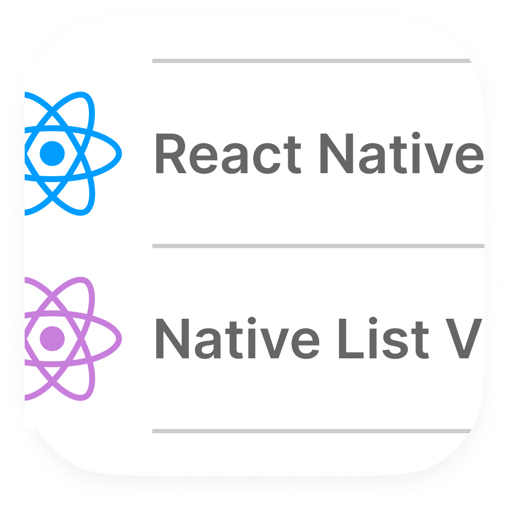

<div style="display: flex; gap: 10px; height: 100px !important;">
    
    <h1>RN Native Listview</h1>
</div>
<br>

[](https://badge.fury.io/js/rn-native-listview)
[](https://opensource.org/licenses/MIT)
[](https://www.npmjs.com/package/rn-native-listview)
<hr>

### 💪 Motivation
ReactNative is a great framework for building mobile applications.
It is a great choice for developers who want to build cross-platform applications.
However, many components are not really native. They are perfect for customizing the UI, but they are not perfect for app which as to be native.

I didn't find any library that allows me to use a native list components in ReactNative, so I decided to create one.

### 🚀 Getting Started
#### Prerequisites

You need to have an Expo project. ReactNative is not supported yet.

#### Installation
To install the package, run the following command:
```bash
npm install rn-native-listview
```

#### Usage
```jsx
import { NativeListView } from 'rn-native-listview';

const App = () => {
  return (
    <NativeListView>
      <Text>Hello World</Text>
    </NativeListView>
  );
};

export default App;
```

### 📋 Properties

#### list_style (iOS only)
The style of the list.<br>
**Available values**: `plain`, `grouped`, `insetGrouped`

### 📝 License
This project is licensed under the MIT License - see the [LICENSE](LICENSE) file for details.